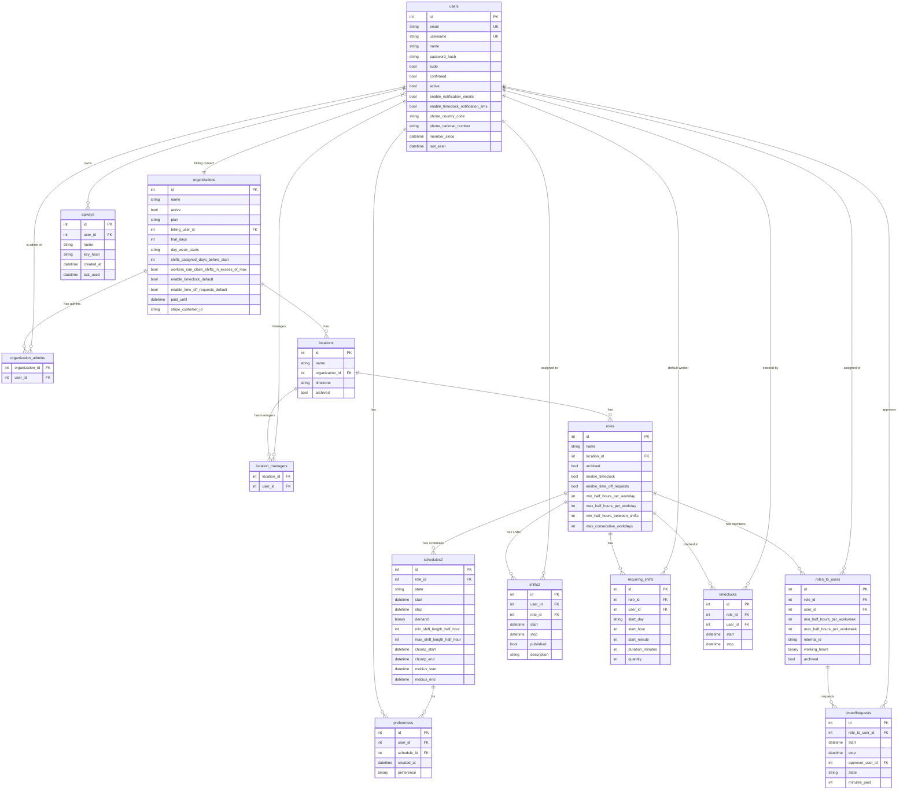

# Staffjoy Suite V1 — Research Report

**Verdict: REFERENCE**
Mine for shift overlap logic, schedule state machine, and the Role→Location→Org hierarchy. Do not adopt any code directly — wrong language, wrong DB, wrong domain.

---

## Summary

Staffjoy Suite V1 is an open-source workforce management platform built for on-demand companies and call centers. The company shut down in 2017 and released the code under MIT. It handles employee scheduling, shift claiming, time-off requests, and clock-in/out. The scheduling pipeline is the most interesting part: a multi-stage state machine feeds into two external microservices (Chomp for shift forecasting, Mobius for worker assignment).

The data model is a clean three-level hierarchy: **Organization → Location → Role**, with users attached to roles via a join table. This maps well to our security domain (Tenant → Site → Post/Role). The shift overlap detection and scheduling constraint logic are worth studying carefully.

---

## Stack and Dependencies

| Dimension | Detail |
|---|---|
| Language | Python (Flask) |
| Database | MySQL + Redis (cache layer) |
| ORM | SQLAlchemy (Flask-SQLAlchemy) |
| Auth | HTTP Basic Auth with time-based tokens (6h) or permanent API keys |
| Email | Mandrill |
| SMS | Twilio IVR |
| Deployment | Docker on AWS Elastic Beanstalk, RDS MySQL, Elasticache Redis |
| External services | Chomp (shift scaffold forecasting), Mobius (worker auto-assignment) |
| License | **MIT** — clean, no restrictions |
| Highcharts note | Frontend charting uses Highcharts, which requires a commercial license for production use |

GitHub: https://github.com/Staffjoy/suite

---

## Data Model

### Entity Summary

| Table | Key Fields | Notes |
|---|---|---|
| `users` | id, email, username, name, password_hash, phone, sudo, confirmed, active, member_since, last_seen | Platform-wide. `sudo` = super-admin |
| `organizations` | id, name, active, plan, billing_user_id, trial_days, day_week_starts, shifts_assigned_days_before_start | Tenant equivalent. Billing + scheduling config |
| `organization_admins` | organization_id, user_id | M2M join — org-level admins |
| `locations` | id, name, organization_id, timezone, archived | Physical site. Has managers M2M |
| `location_managers` | location_id, user_id | M2M join — site-level managers |
| `roles` | id, name, location_id, archived, enable_timeclock, enable_time_off_requests, min/max_half_hours_per_workday, min_half_hours_between_shifts, max_consecutive_workdays | Job role at a location. Carries scheduling constraints |
| `roles_to_users` | id, role_id, user_id, min/max_half_hours_per_workweek, internal_id, working_hours (binary), archived | Worker-role assignment. Per-worker weekly hour caps |
| `schedules2` | id, role_id, state, start, stop, demand (binary), min/max_shift_length_half_hour, chomp/mobius timestamps | Week-long scheduling window. State machine entity |
| `shifts2` | id, user_id (nullable), role_id, start, stop, published, description | Individual shift. `user_id` NULL = open/unclaimed |
| `recurring_shifts` | id, role_id, user_id, start_day, start_hour, start_minute, duration_minutes, quantity | Template for repeating shifts |
| `timeclocks` | id, role_id, user_id, start, stop | Clock-in/out record. `stop` NULL = currently clocked in |
| `timeoffrequests` | id, role_to_user_id, start, stop, approver_user_id, state, minutes_paid | Time off with pay status |
| `preferences` | id, user_id, schedule_id, preference (binary JSON) | Worker shift preferences per schedule week |
| `apikeys` | id, user_id, name, key_hash, created_at, last_used | Permanent API keys (hashed) |

### Mermaid ER Diagram



---

## API / Interface Surface

All routes are under `/api/v2/`. Auth via HTTP Basic — username = time-based token (6h) or permanent API key; password ignored.

### Auth / Users

| Method | Route | Purpose | Permission |
|---|---|---|---|
| GET | `/` | Root — returns current user + access summary | authenticated |
| GET | `/users/` | List users (sudo only) | sudo |
| GET/PATCH | `/users/<user_id>` | Get or update a user | self or sudo |
| GET/POST | `/users/<user_id>/apikeys/` | List or create API keys | self or sudo |
| DELETE | `/users/<user_id>/apikeys/<key_id>` | Revoke API key | self or sudo |
| GET/POST | `/users/<user_id>/sessions/` | List or create sessions | self or sudo |
| DELETE | `/users/<user_id>/sessions/<session_id>` | Invalidate session | self or sudo |

### Organizations

| Method | Route | Purpose | Permission |
|---|---|---|---|
| GET/POST | `/organizations/` | List or create orgs | sudo |
| GET/PATCH | `/organizations/<org_id>` | Get or update org | org_admin or sudo |
| GET/POST | `/organizations/<org_id>/admins/` | List or add org admins | org_admin |
| DELETE | `/organizations/<org_id>/admins/<user_id>` | Remove org admin | org_admin |
| GET | `/organizations/<org_id>/workers/` | List all workers across org | org_member |

### Locations

| Method | Route | Purpose | Permission |
|---|---|---|---|
| GET/POST | `/organizations/<org_id>/locations/` | List or create locations | org_admin |
| GET/PATCH | `/organizations/<org_id>/locations/<loc_id>` | Get or update location | org_admin |
| GET/POST | `…/locations/<loc_id>/managers/` | List or add managers | org_admin |
| DELETE | `…/managers/<user_id>` | Remove manager | org_admin |
| GET | `…/attendance/` | Attendance summary for location | location_manager |
| GET | `…/shifts/` | All shifts at location | location_manager |
| GET | `…/timeclocks/` | All timeclocks at location | location_manager |
| GET | `…/timeoffrequests/` | All time-off requests at location | location_manager |

### Roles

| Method | Route | Purpose | Permission |
|---|---|---|---|
| GET/POST | `…/locations/<loc_id>/roles/` | List or create roles | location_manager |
| GET/PATCH | `…/roles/<role_id>` | Get or update role | location_manager |

### Schedules

| Method | Route | Purpose | Permission |
|---|---|---|---|
| GET/POST | `…/roles/<role_id>/schedules/` | List or create weekly schedules | location_manager |
| GET/PATCH | `…/schedules/<schedule_id>` | Get or update schedule (transitions state) | location_manager |
| GET | `…/schedules/<schedule_id>/shifts/` | Shifts within schedule | location_member |
| GET | `…/schedules/<schedule_id>/timeclocks/` | Timeclocks within schedule | location_manager |
| GET | `…/schedules/<schedule_id>/timeoffrequests/` | TOR within schedule | location_manager |
| GET/POST | `…/schedules/<schedule_id>/preferences/` | Worker shift preferences | location_manager |
| GET/PATCH | `…/preferences/<user_id>` | Single worker preference | self or location_manager |

### Shifts

| Method | Route | Purpose | Permission |
|---|---|---|---|
| GET/POST | `…/roles/<role_id>/shifts/` | List or create shifts | location_manager |
| GET/PATCH/DELETE | `…/shifts/<shift_id>` | Get, update, or delete shift | location_manager |
| GET | `…/shifts/<shift_id>/users/` | Eligible users for shift (within caps) | location_manager |
| GET | `…/roles/<role_id>/shiftquery/` | Query shifts (date range filter) | location_member |
| GET/POST | `…/roles/<role_id>/recurringshifts/` | Recurring shift templates | location_manager |
| GET/PATCH/DELETE | `…/recurringshifts/<id>` | Manage recurring shift | location_manager |

### Role Members (Workers)

| Method | Route | Purpose | Permission |
|---|---|---|---|
| GET/POST | `…/roles/<role_id>/users/` | List members or add worker to role | location_manager |
| GET/PATCH/DELETE | `…/roles/<role_id>/users/<user_id>` | Manage membership | location_manager |
| GET/POST | `…/users/<user_id>/timeclocks/` | Worker timeclocks | location_manager or self |
| GET/PATCH | `…/timeclocks/<timeclock_id>` | Get or close timeclock | location_manager |
| GET/POST | `…/users/<user_id>/timeoffrequests/` | Worker time-off requests | location_manager_or_self |
| GET/PATCH/DELETE | `…/timeoffrequests/<id>` | Manage time-off request | location_manager_or_self |

### Plans / Utility

| Method | Route | Purpose |
|---|---|---|
| GET | `/plans/` | List subscription plans |
| GET | `/plans/<plan_id>` | Single plan details |
| GET | `/timezones/` | List valid timezones |

### Internal (cron / microservices only)

| Route | Purpose |
|---|---|
| `/internal/cron/` | 60s heartbeat — advances schedule states, sends alerts |
| `/internal/schedulemonitoring/` | Alert if schedules stuck in processing too long |
| `/internal/tasking/chomp/` | Chomp queue (shift scaffold) |
| `/internal/tasking/mobius/` | Mobius queue (worker assignment) |
| `/internal/caches/` | Cache invalidation |
| `/internal/kpis/` | KPI tracking |

---

## Multi-Tenancy Approach

Staffjoy's isolation is **hierarchical path-based**, not column-based. Every protected route URL embeds `org_id`, and every decorator verifies the chain:

```
org → location → role → schedule/shift/user
```

The `verify_org_location`, `verify_org_location_role`, etc. decorators join all the way up to `organizations.id` on every query. No org can access another org's data because the URL's `org_id` acts as the tenant scope, and every nested resource query joins back to it.

There is no `tenant_id` column on subordinate tables — isolation comes from foreign key traversal, not column filtering. This means a stray query without the join decorator would not be scoped. It is less defensive than a column-per-table approach.

**How this compares to Arrow Security:** We embed `tenantId` in the JWT and filter every query with `eq(table.tenantId, payload.tenantId)`. This is more robust for a flat table model. Staffjoy's approach requires discipline on URL structure and join chains, but works well when the hierarchy is strictly enforced.

---

## Permissions / Role Model

Five permission levels implemented as Python decorators in `app/apiv2/decorators.py`:

| Level | Decorator | Who qualifies |
|---|---|---|
| `sudo` | `permission_sudo` | Platform super-admins (`users.sudo = true`) |
| `org_admin` | `permission_org_admin` | Listed in `organization_admins` M2M, or sudo |
| `location_manager` | `permission_location_manager` | Listed in `location_managers` M2M, org_admin, or sudo |
| `location_member` | `permission_location_member` | Workers with active `RoleToUser` at the location, plus managers and up |
| `self` | `permission_self` | User matching `user_id` in route, or sudo |
| `location_manager_or_self` | `permission_location_manager_or_self` | Enables guards to manage their own time-off requests |

There is no explicit "worker" role object — workers are defined by having an active row in `roles_to_users`. Managers are defined by rows in `location_managers`. Access tiers are computed from DB relationships at request time, not stored as an enum.

Key distinction from Arrow Security: Staffjoy's "role" concept (the `roles` table) is a **job type** (e.g., "Barista", "Driver"), not an **access tier**. Arrow Security uses a `role` enum field on `users` (`platform_admin`, `tenant_admin`, `supervisor`, `guard`, `client_viewer`). Our approach is simpler and sufficient for a two-level hierarchy (admin/supervisor vs. guard).

---

## Algorithms and Techniques Worth Borrowing

### 1. Shift Overlap Detection (three-case OR query)

Used identically in `Shift2.has_overlaps()`, `Timeclock.has_overlaps()`, and `TimeOffRequest.has_overlaps()`. Catches all temporal overlap scenarios:

```python
# Case 1: self is contained within another record
other.start <= self.start AND other.stop >= self.stop

# Case 2: another record starts during self
other.start >= self.start AND other.start < self.stop

# Case 3: another record ends during self
other.stop > self.start AND other.stop <= self.stop
```

This pattern should be applied to our `POST /attendance` handler to prevent a guard from having two simultaneous clock-in records. It should also be applied to `POST /shifts` to prevent a guard being scheduled in two overlapping shifts.

### 2. Schedule State Machine (7-state pipeline)

States: `initial → unpublished → chomp-queue → chomp-processing → mobius-queue → mobius-processing → published`

Each `transition_to_X` method validates the current state before advancing, clears the Redis cache, and sends targeted email notifications (e.g., scaffold computed, schedule published). A monitoring endpoint alerts if a schedule is stuck in a processing state too long. For Arrow Security, a simpler `draft → published` version of this pattern is directly applicable for roster publishing with FCM notifications to guards.

### 3. Worker Hour Cap Enforcement (`is_within_caps`)

Four constraints enforced at shift assignment time:
- Max hours per workday (`roles.max_half_hours_per_workday`)
- Max hours per workweek (`roles_to_users.max_half_hours_per_workweek` — per-worker override)
- Minimum gap between shifts (`roles.min_half_hours_between_shifts`)
- Maximum consecutive workdays (`roles.max_consecutive_workdays`)

The algorithm collects all shifts for the week, appends the candidate shift, sorts by start, and walks through them checking all constraints. Time is stored in UTC but constraints are evaluated in the location's local timezone (a shift from 10pm–6am splits at midnight-local before accumulating daily hours). Directly applicable to our payroll cap enforcement and overtime alerting.

### 4. Recurring Shift Materialization

`RecurringShift` stores a template (day-of-week, time, duration, quantity). When a schedule is promoted from `initial` to `unpublished`, `create_shift2_for_schedule2` materializes actual `Shift2` rows for that week. The `quantity` field handles "3 guards needed every Monday night" — three shift rows from one template row. This avoids storing 52 weeks of shifts upfront.

### 5. API Key Hashing Pattern

Plain key stored only at generation time. `key_hash` = Werkzeug `generate_password_hash`. Token returned to user is a signed JSON blob `{id, key}` via `itsdangerous.JSONWebSignatureSerializer`. On auth: decode blob, fetch `ApiKey` by id, then `check_password_hash`. Sends security email on creation. Applicable when Arrow adds API keys for client portal integrations.

### 6. Time-Off Approval Auto-Unassignment

When a time-off request is approved, `unassign_overlapping_shifts()` runs the three-case overlap query against the guard's future shifts in that date range and sets `user_id = NULL` on each match. This automatically creates open shifts that supervisors can backfill. The behavior is opt-in per organization in Staffjoy; for Arrow it should be the default.

---

## What's Missing for a Security App

Staffjoy is a generic workforce tool. The following are entirely absent:

| Missing Concept | Why It Matters for Security |
|---|---|
| **Incident reports** | No model for events, severity, SLA, or resolution workflow |
| **Patrol routes and checkpoints** | No concept of a guard touring a site with scan points |
| **QR / NFC checkpoint scanning** | No scan events, no sequence validation |
| **Geofencing** | Locations have no lat/lng or radius — no GPS check-in validation |
| **Guard GPS tracking** | No live location pings, no trail history, no SSE fan-out |
| **Panic / duress button** | No emergency event type |
| **Client portal** | Protected companies don't exist as entities |
| **Attendance method** | Timeclock has no method (GPS, QR, NFC, face) — pure clock-in/out |
| **Shift lifecycle** | Shifts are published/unpublished, not `scheduled → active → completed → no_show` |
| **Payroll calculation** | No pay rates, no statutory deductions, no paise-level precision |
| **Multi-tenant column isolation** | Single org-per-deployment assumed; no `tenantId` column on subordinate tables |
| **Guard qualification/certification** | No concept of PSO licence, guard card, or site-specific training requirements |
| **Camera / sensor integration** | No camera model or event stream |
| **Minimum post coverage SLA** | Demand blob exists but algorithmic enforcement (Chomp) was never open-sourced |

---

## Schema Port — Drizzle ORM Equivalents

These are the Staffjoy concepts worth translating to our stack.

### Organization → Tenant (already exists, augment)

```typescript
// Staffjoy ideas worth adding to packages/db/src/schema/tenants.ts:
dayWeekStarts: text("day_week_starts")
  .$type<"monday"|"tuesday"|"wednesday"|"thursday"|"friday"|"saturday"|"sunday">()
  .notNull().default("monday"),
shiftsAssignedDaysBefore: integer("shifts_assigned_days_before").notNull().default(4),
timezoneDefault: text("timezone_default").notNull().default("Asia/Kolkata"),
```

### Location → Site (already exists, augment)

```typescript
// Already have: name, address, lat, lng, geofenceRadius, tenantId
// Add from Staffjoy:
timezone: text("timezone").notNull().default("Asia/Kolkata"),
archived: boolean("archived").notNull().default(false),
```

### Role → Post (NEW — job type at a site)

Staffjoy's `roles` table is a job category at a location (e.g., "Night Watch", "Lobby Guard"). We do not currently have this concept — guards are assigned directly to sites. For multi-post sites this is worth adding:

```typescript
// packages/db/src/schema/posts.ts
export const posts = pgTable("posts", {
  id: text("id").primaryKey().$defaultFn(createId),
  tenantId: text("tenant_id").notNull().references(() => tenants.id),
  siteId: text("site_id").notNull().references(() => sites.id),
  name: text("name").notNull(),                       // "Gate 1 Guard", "Roving Patrol"
  archived: boolean("archived").notNull().default(false),
  enableTimeclock: boolean("enable_timeclock").notNull().default(true),
  // Scheduling constraints (from Staffjoy roles table — all in half-hours):
  minHalfHoursPerWorkday: integer("min_half_hours_per_workday").notNull().default(8),
  maxHalfHoursPerWorkday: integer("max_half_hours_per_workday").notNull().default(16),
  minHalfHoursBetweenShifts: integer("min_half_hours_between_shifts").notNull().default(24),
  maxConsecutiveWorkdays: integer("max_consecutive_workdays").notNull().default(6),
  createdAt: timestamp("created_at").notNull().defaultNow(),
});
```

### RoleToUser → PostAssignment (NEW)

```typescript
// packages/db/src/schema/post_assignments.ts
export const postAssignments = pgTable("post_assignments", {
  id: text("id").primaryKey().$defaultFn(createId),
  tenantId: text("tenant_id").notNull().references(() => tenants.id),
  postId: text("post_id").notNull().references(() => posts.id),
  userId: text("user_id").notNull().references(() => users.id),
  minHalfHoursPerWeek: integer("min_half_hours_per_week").notNull().default(40),
  maxHalfHoursPerWeek: integer("max_half_hours_per_week").notNull().default(80),
  internalId: text("internal_id"),                   // employee number
  archived: boolean("archived").notNull().default(false),
  createdAt: timestamp("created_at").notNull().defaultNow(),
}, (t) => ({
  postUserIdx: uniqueIndex("post_assignment_post_user_idx").on(t.postId, t.userId),
}));
```

### Schedule2 → ShiftWeek (NEW — roster container)

Our current `shifts` table lacks a week-level container. For roster publishing workflows:

```typescript
// packages/db/src/schema/shift_weeks.ts
export const shiftWeeks = pgTable("shift_weeks", {
  id: text("id").primaryKey().$defaultFn(createId),
  tenantId: text("tenant_id").notNull().references(() => tenants.id),
  siteId: text("site_id").notNull().references(() => sites.id),
  weekStart: timestamp("week_start").notNull(),       // Monday midnight UTC
  weekStop: timestamp("week_stop").notNull(),
  state: text("state")
    .$type<"draft"|"published"|"locked">()
    .notNull().default("draft"),
  createdAt: timestamp("created_at").notNull().defaultNow(),
  publishedAt: timestamp("published_at"),
});
```

### Shift (already exists, augment)

```typescript
// Staffjoy Shift2 ideas for our shifts table:
// - published: boolean nullable false default false (draft roster before guard can see)
// - description: text (post-specific instructions)
// - user_id nullable = open/unassigned shift (already supported by nullable guardId)
// - postId FK when posts table is added
```

### Timeclock → AttendanceRecord (already exists, add overlap check)

Our `attendance_records` table already covers this. The three-case overlap query from `Timeclock.has_overlaps()` should be implemented in `POST /attendance` to prevent duplicate clock-ins.

### TimeOffRequest (NEW)

```typescript
// packages/db/src/schema/time_off_requests.ts
export const timeOffRequests = pgTable("time_off_requests", {
  id: text("id").primaryKey().$defaultFn(createId),
  tenantId: text("tenant_id").notNull().references(() => tenants.id),
  userId: text("user_id").notNull().references(() => users.id),
  approverUserId: text("approver_user_id").references(() => users.id),
  start: timestamp("start").notNull(),
  stop: timestamp("stop").notNull(),
  state: text("state")
    .$type<"pending"|"approved_paid"|"approved_unpaid"|"sick"|"denied">()
    .notNull().default("pending"),
  minutesPaid: integer("minutes_paid").notNull().default(0),
  reason: text("reason"),
  createdAt: timestamp("created_at").notNull().defaultNow(),
});
// On approval: run three-case overlap query and set guardId = null on matching future shifts
```

### RecurringShift (NEW)

```typescript
// packages/db/src/schema/recurring_shifts.ts
export const recurringShifts = pgTable("recurring_shifts", {
  id: text("id").primaryKey().$defaultFn(createId),
  tenantId: text("tenant_id").notNull().references(() => tenants.id),
  siteId: text("site_id").notNull().references(() => sites.id),
  postId: text("post_id").references(() => posts.id),
  userId: text("user_id").references(() => users.id),   // null = open recurring slot
  startDay: text("start_day")
    .$type<"monday"|"tuesday"|"wednesday"|"thursday"|"friday"|"saturday"|"sunday">()
    .notNull(),
  startHour: integer("start_hour").notNull(),
  startMinute: integer("start_minute").notNull().default(0),
  durationMinutes: integer("duration_minutes").notNull().default(480),
  quantity: integer("quantity").notNull().default(1), // how many guards for this slot
  active: boolean("active").notNull().default(true),
  createdAt: timestamp("created_at").notNull().defaultNow(),
});
```

---

## Concrete Extracts (GitHub URLs + Line Ranges)

| File | Content | URL |
|---|---|---|
| `app/models/user_model.py` | All user fields, token auth, SMS verification | https://github.com/Staffjoy/suite/blob/master/app/models/user_model.py |
| `app/models/organization_model.py` | Org fields, billing, plan logic, worker_count query | https://github.com/Staffjoy/suite/blob/master/app/models/organization_model.py |
| `app/models/location_model.py` | Location fields, manager M2M, timezone | https://github.com/Staffjoy/suite/blob/master/app/models/location_model.py |
| `app/models/role_model.py` | Role fields, scheduling constraints | https://github.com/Staffjoy/suite/blob/master/app/models/role_model.py |
| `app/models/role_to_user_model.py` | Worker-role join, per-worker caps | https://github.com/Staffjoy/suite/blob/master/app/models/role_to_user_model.py |
| `app/models/schedule2_model.py` | Schedule state machine, overlap prevention | https://github.com/Staffjoy/suite/blob/master/app/models/schedule2_model.py |
| `app/models/shift2_model.py` | Shift overlap detection (lines ~50–90), cap checking (lines ~100–220) | https://github.com/Staffjoy/suite/blob/master/app/models/shift2_model.py |
| `app/models/timeclock_model.py` | Clock-in/out overlap detection | https://github.com/Staffjoy/suite/blob/master/app/models/timeclock_model.py |
| `app/models/time_off_request_model.py` | TOR overlap, shift auto-unassignment on approval | https://github.com/Staffjoy/suite/blob/master/app/models/time_off_request_model.py |
| `app/models/recurring_shift_model.py` | Recurring shift materialization (lines ~40–110) | https://github.com/Staffjoy/suite/blob/master/app/models/recurring_shift_model.py |
| `app/models/api_key_model.py` | API key hashing and signed token pattern | https://github.com/Staffjoy/suite/blob/master/app/models/api_key_model.py |
| `app/models/preference_model.py` | Worker availability preference blob | https://github.com/Staffjoy/suite/blob/master/app/models/preference_model.py |
| `app/apiv2/routes.py` | Full route registration, URL hierarchy | https://github.com/Staffjoy/suite/blob/master/app/apiv2/routes.py |
| `app/apiv2/decorators.py` | All permission decorator implementations (lines ~100–220) | https://github.com/Staffjoy/suite/blob/master/app/apiv2/decorators.py |

---

## Open Questions for Synthesis

1. **Posts table priority**: Do we add a `posts` table now to support multi-post sites, or model it as a `shift.description` field until a client requires it? Posts enable proper scheduling constraint inheritance but add a join to every shift query.

2. **Recurring shifts vs manual roster**: Staffjoy materializes recurring shifts via a state machine transition. Our `/roster` page is a custom weekly grid. Do we want a `recurring_shifts` table that auto-populates the roster, or keep roster creation fully manual?

3. **Time-off request workflow**: The approval flow (pending → approved/denied with pay type) is not in Arrow Security. Should it be part of Phase 2 or deferred? Guards currently have no way to request leave in the system.

4. **Cap enforcement timing**: Staffjoy enforces hour caps at shift assignment time. Should Arrow enforce at shift creation, or only surface violations as warnings in payroll calculation?

5. **Week container (ShiftWeek)**: A `shift_weeks` container enables "publish the whole week at once" and prevents schedule overlap. The current Arrow model allows overlapping shifts to be created freely. Is this a compliance gap for security operations (where a site left uncovered is a contractual breach)?

6. **Shift eligibility endpoint priority**: `GET /shifts/:id/eligible-guards` (replicating Staffjoy's `ShiftEligibleUsersApi`) would be the roster page's most useful feature — click an open shift, see who can fill it without violating caps. Is this worth building before the cap constraint tables exist?

7. **Multi-org scaling**: Staffjoy assumes multiple orgs per deployment but uses path-based isolation. Arrow uses `tenantId` columns. When white-labelling is added, confirm that every table has a `tenantId` FK and that no query can accidentally cross tenant boundaries.
