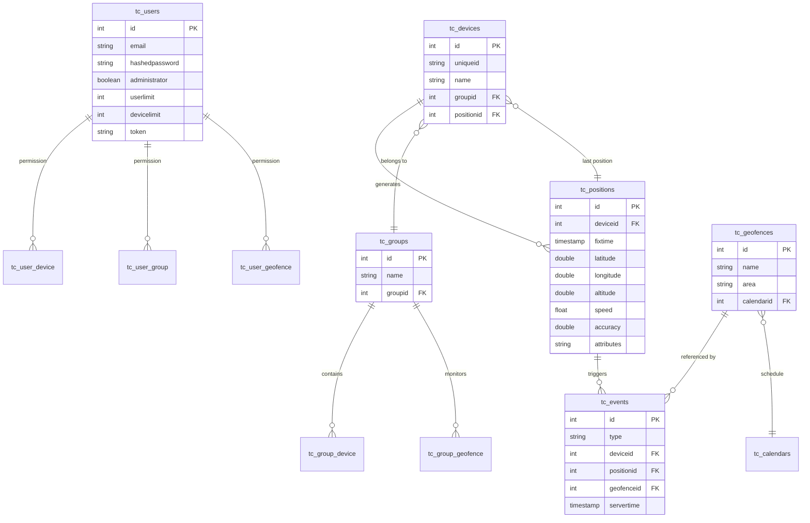

# Investigation 12 — Traccar GPS Tracking Platform

**Date:** 2026-05-17  
**Repos examined:**
- https://github.com/traccar/traccar (Java backend, v6.13.3)
- https://github.com/traccar/traccar-web (React + MapLibre frontend)
- https://github.com/traccar/traccar-client (Flutter cross-platform client, supersedes android/ios repos)
- https://github.com/traccar/traccar-client-android (deprecated, moved to traccar-client)
- https://github.com/traccar/traccar-client-ios (deprecated, moved to traccar-client)

---

## Summary

Traccar is a mature, Apache 2.0-licensed GPS tracking server with 7.3k GitHub stars, 3.3k forks, and 73 releases (latest v6.13.3, May 2026). It is explicitly designed to run on PostgreSQL — the database compatibility question is a **non-issue**. PostgreSQL is a first-class supported backend alongside MySQL and MS SQL Server, with TimescaleDB recommended for large-scale position history.

**The honest assessment:** Traccar solves the GPS ingest, device management, geofence event firing, and position history reporting layers very well. Running it as a sidecar service alongside the Arrow API is architecturally clean and feasible. However, Traccar's "multi-tenancy" is shallow (admin → manager → user hierarchy, not a tenant-isolated data model), and all the things that make Arrow valuable — shift scheduling, incident reports, patrol checkpoints, payroll, client portal — Traccar does not touch. The core integration question is whether the benefit of replacing our hand-rolled `guard_locations` table and SSE map with Traccar's full GPS stack outweighs the operational cost of running an additional Java service.

**Verdict: LIBRARY (run-as-sidecar) with selective borrowing.** Traccar is best used as a co-deployed service that Arrow calls via its REST API for position history and geofence events, while the Arrow API continues to own identity, shifts, and business logic. The WebSocket push model and geofence containment algorithms are also worth referencing directly.

---

## Stack & Dependencies

| Layer | Technology |
|-------|-----------|
| Language | Java (99.2% of backend) |
| Framework | Netty (protocol decoding) + Jersey/JAX-RS (REST API) |
| Build | Gradle |
| Database | H2 (default/dev), **PostgreSQL** (recommended prod), MySQL, MS SQL Server |
| ORM | Custom `DatabaseStorage` with hand-rolled `QueryBuilder` — not Hibernate |
| Schema migrations | Liquibase (XML changelogs in `/schema/`) |
| Web UI | React + Material UI + MapLibre (separate repo) |
| Mobile client | Flutter (Dart 92.8%, Swift 4.6%) — single cross-platform app supersedes Android/iOS repos |
| Real-time push | WebSocket at `/api/socket` (session-cookie auth only) |
| License | **Apache 2.0** — production-friendly, no copyleft |

The mobile client (traccar-client) uses `flutter_background_geolocation` for background location and posts via HTTP. It is **not** a Capacitor/Ionic app — it is a fully native Flutter app whose only purpose is to act as a GPS tracker sending coordinates to a server URL.

---

## Data Model

### Core tables (from `changelog-4.0-clean.xml`)

**`tc_devices`** — one row per tracked device (maps to our guards)
```
id           INT PK auto-increment
name         VARCHAR(128)
uniqueid     VARCHAR(128) UNIQUE   -- device's identifier string
lastupdate   TIMESTAMP
positionid   INT                   -- FK to latest position
groupid      INT                   -- FK to tc_groups
phone        VARCHAR(128)
model        VARCHAR(128)
contact      VARCHAR(512)
category     VARCHAR(128)
disabled     BOOLEAN
```

**`tc_positions`** — every GPS fix (time-series, can be TimescaleDB hypertable)
```
id           INT PK auto-increment
protocol     VARCHAR(128)          -- which protocol decoder produced this
deviceid     INT                   -- FK to tc_devices
servertime   TIMESTAMP             -- when server received it
devicetime   TIMESTAMP             -- device clock
fixtime      TIMESTAMP             -- GPS fix time
valid        BOOLEAN
latitude     DOUBLE
longitude    DOUBLE
altitude     FLOAT
speed        FLOAT                 -- knots
course       FLOAT
address      VARCHAR(512)          -- reverse geocoded
accuracy     DOUBLE
network      VARCHAR(4000)         -- cell/WiFi JSON blob
attributes   VARCHAR(4000)        -- extensible JSON: battery, odometer, etc.
geofenceIds  (list, not a column — computed at ingest time)
```

**`tc_events`** — fired events (geofence enter/exit, alarms, online/offline)
```
id            INT PK
type          VARCHAR(128)         -- one of ~22 TYPE_ constants
servertime    TIMESTAMP
deviceid      INT
positionid    INT
geofenceid    INT                  -- populated for geofence events
maintenanceid INT
attributes    VARCHAR(4000)
```

**`tc_users`**
```
id              INT PK
name            VARCHAR(128)
email           VARCHAR(128) UNIQUE
hashedpassword  VARCHAR(128)
salt            VARCHAR(128)
administrator   BOOLEAN
readonly        BOOLEAN
devicelimit     INT
userlimit       INT                -- how many sub-users this manager can create
devicereadonly  BOOLEAN
expirationtime  TIMESTAMP
token           VARCHAR(128)
attributes      VARCHAR(4000)
```

**`tc_geofences`**
```
id           INT PK
name         VARCHAR(128)
description  VARCHAR(128)
area         VARCHAR(4096)        -- WKT string: CIRCLE(), POLYGON(), LINESTRING()
calendarid   INT                  -- optional: only fire events during calendar windows
attributes   VARCHAR(4000)
```

**`tc_groups`** — hierarchical device grouping
```
id          INT PK
name        VARCHAR(128)
groupid     INT                   -- parent group (self-referential)
attributes  VARCHAR(4000)
```

**Junction tables** (permissions, many-to-many):
`tc_user_device`, `tc_user_group`, `tc_user_geofence`, `tc_group_device`, `tc_group_geofence`, etc. — all managed through `PermissionsResource`.

### Mermaid entity diagram



---

## API / Interface Surface

### Authentication

Three methods supported:
1. **Session cookie** — `POST /api/session` with email + password (+ optional TOTP), returns `Set-Cookie`
2. **HTTP Basic** — standard `Authorization: Basic` header
3. **Bearer token** — `GET /api/session?token=USER_TOKEN` to establish session; tokens generated via `POST /api/session/token`
4. **OIDC/OAuth2** — `GET /api/session/openid/auth` initiates flow

The WebSocket (`/api/socket`) only supports session cookies — Bearer tokens cannot authenticate it directly. This matters for our integration.

### REST endpoints (from resource classes)

```
# Session
POST   /api/session                  login (email+password)
GET    /api/session                  get current user
DELETE /api/session                  logout
POST   /api/session/token            create API token
POST   /api/session/token/revoke     revoke token

# Devices
GET    /api/devices                  list (filters: all, userId, uniqueId[], id[], keyword, limit, offset)
POST   /api/devices                  create device
PUT    /api/devices/{id}             update device
DELETE /api/devices/{id}             delete device
PUT    /api/devices/{id}/accumulators  update odometer/hours

# Positions
GET    /api/positions                history (deviceId, id[], geofenceId, from, to)
DELETE /api/positions/{id}           delete single position
DELETE /api/positions                delete range (deviceId, from, to)
GET    /api/positions/csv            export CSV
GET    /api/positions/{kml|kmz}      export KML/KMZ
GET    /api/positions/gpx            export GPX

# Events
GET    /api/events/{id}              single event by ID

# Geofences
GET    /api/geofences                list geofences
POST   /api/geofences                create geofence (WKT area string)
PUT    /api/geofences/{id}           update
DELETE /api/geofences/{id}           delete

# Groups
GET    /api/groups                   list
POST   /api/groups                   create
PUT    /api/groups/{id}              update
DELETE /api/groups/{id}              delete

# Users
GET    /api/users                    list (userId, deviceId, keyword, pagination)
POST   /api/users                    create (public, no auth)
DELETE /api/users/{id}              delete
POST   /api/users/totp               generate TOTP key

# Permissions (junction table management)
POST   /api/permissions             link owner+property (user→device, group→geofence, etc.)
DELETE /api/permissions             unlink

# Reports
GET    /api/reports/route            position trail for date range
GET    /api/reports/events           events in range (type, alarm filters)
GET    /api/reports/summary          distance/speed summary
GET    /api/reports/trips            trip detection
GET    /api/reports/stops            stop detection
GET    /api/reports/geofences        time inside each geofence
GET    /api/reports/combined         all-in-one
GET    /api/reports/devices          device status report
# All reports also accept /{xlsx} suffix for Excel download or /{mail} for email delivery

# Real-time
GET    /api/socket                   WebSocket (session cookie auth; pushes devices/positions/events)

# Other
GET    /api/server                   server info + config
GET    /api/statistics               usage stats
```

### Position ingest (how devices POST GPS data)

Traccar supports 200+ protocols. The relevant one for HTTP-based mobile apps is the **OsmAnd protocol** (HTTP GET/POST to a configurable port, default often 5055):

```
GET http://traccar-host:5055/?id=DEVICE_UNIQUE_ID&lat=12.34&lon=56.78
    &timestamp=1716000000&speed=0&bearing=0&altitude=100&accuracy=5
    &batt=85&charge=true
```

Or JSON POST body (Traccar client v9+):
```json
{
  "device_id": "DEVICE_UNIQUE_ID",
  "location": {
    "timestamp": "2026-05-17T10:00:00Z",
    "coords": {
      "latitude": 12.34,
      "longitude": 56.78,
      "speed": 0,
      "heading": 0,
      "accuracy": 5,
      "altitude": 100
    },
    "battery": { "level": 0.85, "is_charging": true },
    "is_moving": false
  }
}
```

Any extra query parameters become custom position attributes stored in the `attributes` JSON blob.

### WebSocket push format

```json
{
  "positions": [{ ...position_object }],
  "devices":   [{ ...device_object }],
  "events":    [{ ...event_object }]
}
```

Keepalive: empty `{}` sent periodically. Push is event-driven — only triggered on actual updates, not polling.

---

## Algorithms / Techniques Worth Borrowing

### 1. Geofence containment — set-diff on consecutive positions

`GeofenceEventHandler` compares geofence membership between the **previous position** and the **current position**:

```
oldGeofences = Set<id> from last position
newGeofences = Set<id> from current position (computed by GeofenceUtil.getCurrentGeofences)

for id in (oldGeofences - newGeofences): fire TYPE_GEOFENCE_EXIT
for id in (newGeofences - oldGeofences): fire TYPE_GEOFENCE_ENTER
```

Calendar-gating: events are suppressed if the geofence has an associated calendar and the current time is outside the calendar window. This is elegant for business-hours-only geofence alerting.

This is directly applicable to our patrol checkpoint and site geofence logic. Our current SSE implementation does not do geofence event detection at all.

### 2. WKT area representation for geofences

Geofences store their geometry as WKT strings in a single `area` column:
- Circle: `CIRCLE (lat lon, radius)`
- Polygon: `POLYGON ((lon1 lat1, lon2 lat2, ...))`
- Polyline with buffer: `LINESTRING (lon1 lat1, lon2 lat2, ...)` + `geofence.polylineDistance` config

This is simpler than storing separate geometry columns and works well with PostGIS. Our current `sites` table stores `geofenceRadius` as a float — we could upgrade to a proper WKT/PostGIS `GEOMETRY` column.

### 3. Position batch writer

Positions are queued in a `ConcurrentLinkedQueue` and flushed on a configurable schedule (`storage.batchSize`, `storage.batchInterval`). Each write returns a `CompletableFuture<Long>`. For 30-second guard pings at low volume this doesn't matter much, but for high-frequency tracking it's the right pattern.

### 4. Extensible attributes blob

Both positions and devices use a JSON `attributes` column for flexible key-value extension without schema migrations. Every field that doesn't fit the core model goes there: `KEY_BATTERY_LEVEL`, `KEY_ODOMETER`, custom protocol fields. We do this informally — worth making it a formal pattern in our schema.

### 5. Permission junction table model

The `tc_user_device` / `tc_user_geofence` / `tc_group_device` junction table approach is clean for fine-grained access control. A manager user gets a `userLimit` budget and can create sub-users who only see their assigned devices/groups. This is more flexible than our current single `tenantId` column approach.

---

## What Traccar DOESN'T Solve (stays in our app)

| Domain | Status in Traccar |
|--------|-------------------|
| Shift scheduling & roster | Not present |
| Attendance check-in/out (GPS + QR + face) | Not present |
| Patrol sessions + checkpoint scanning | Not present |
| Incident reporting | Not present |
| Client portal (client_viewer role) | Not present |
| Payroll calculation (ESI/PF, paise) | Not present |
| Multi-tenant data isolation | Shallow — user hierarchy, not tenant-scoped rows |
| Guard identity linked to your user table | Not present — Traccar devices are separate from auth users |

**Multi-tenancy gap is significant:** Traccar's model is: one admin → managers → users → devices. There is no `tenantId` column in any table. For Arrow's use case (one active tenant for now, white-label later), this means you can't run multiple clients' guard fleets isolated in one Traccar instance without careful group-based partitioning and permission management. You'd essentially use Traccar Groups as tenants and Manager accounts as tenant admins, which is fragile.

---

## Verdict

**LIBRARY (run-as-sidecar) — conditional recommendation.**

### What this looks like concretely

```
┌─────────────────────────────────────┐    ┌──────────────────────┐
│       Arrow Fastify API (:4000)     │    │   Traccar (:8082)    │
│                                     │    │                      │
│  guard identity, shifts, incidents, │───▶│  POST /api/devices   │
│  patrol, payroll, client portal     │    │  (one per guard)     │
│                                     │◀───│                      │
│  GET /api/locations/history    ─────│────│  GET /api/positions  │
│  GET /api/locations/live (SSE) ─────│────│  WS /api/socket      │
│  geofence events              ──────│────│  Events push         │
└─────────────────────────────────────┘    └──────────────────────┘
         ▲                                          ▲
         │                                          │
    mobile guard                              (position ingest
     app POSTs                              via OsmAnd HTTP or
    to Arrow API,                          Arrow proxies to Traccar)
   Arrow proxies
   to Traccar
```

Alternatively, the mobile app can POST directly to Traccar's OsmAnd endpoint while also talking to Arrow for all business logic. Guard `uniqueId` in Traccar = guard's user ID from Arrow's database.

### Why LIBRARY over PORT

1. **PostgreSQL is supported natively** — no impedance mismatch. Traccar's schema can live in a separate PostgreSQL schema (`traccar.*`) in the same cluster.
2. **Geofence event detection is non-trivial to reimplement correctly** (set-diff algorithm, calendar gating, WKT containment) — getting it from a mature open-source project is lower risk.
3. **200+ protocol decoders** — we only need OsmAnd/HTTP, but future hardware GPS trackers for vehicles come free.
4. **Reports API** (route export, trips, stops, geofence dwell time) would take months to build ourselves.
5. **Apache 2.0** — no license friction.

### Why it might not be worth it

1. **Operational complexity:** Another service to deploy, monitor, upgrade. Docker makes it one container, but it's still a Java JVM with its own config file.
2. **Multi-tenancy gap:** We'd need to carefully map our `tenantId` to Traccar Groups and ensure Managers can't cross-see data. Not impossible but not automatic.
3. **Our current GPS needs are modest:** 30-second pings from ≤50 simultaneous guards. Our hand-rolled `guard_locations` table + SSE fan-out already works. Traccar's value becomes clearer if we add vehicle tracking, geofence alerting on site entry/exit, or dwell-time reporting.
4. **Authentication mismatch:** Traccar uses its own user database with its own passwords. Arrow guards would need Traccar device accounts synced separately. Arrow can't use its JWTs with Traccar's WebSocket (session-cookie only).

### Recommended integration path (if adopted)

1. Deploy Traccar via Docker alongside existing services (add to `docker-compose.yml`)
2. Configure PostgreSQL backend pointing to same cluster, separate DB: `traccardb`
3. On guard creation in Arrow, call `POST /api/devices` to Traccar with `uniqueId = arrow_user_id`
4. On shift start in mobile app, begin posting positions to Traccar's OsmAnd endpoint (in addition to or instead of Arrow's `/api/locations`)
5. Arrow's `/api/locations/live` SSE endpoint refactored to subscribe to Traccar WebSocket and re-broadcast (or replace the tenant map page to connect directly to Traccar WebSocket via a proxied session)
6. Arrow calls `GET /api/positions?deviceId=&from=&to=` for history trail
7. Arrow subscribes to Traccar WebSocket events for `TYPE_GEOFENCE_ENTER`/`TYPE_GEOFENCE_EXIT` and translates to Arrow incident triggers

---

## Concrete Extracts

### PostgreSQL config (from traccar.xml)
```xml
<entry key='database.driver'>org.postgresql.Driver</entry>
<entry key='database.url'>jdbc:postgresql://localhost/traccardb</entry>
<entry key='database.user'>traccar</entry>
<entry key='database.password'>traccar</entry>
```

### OsmAnd position POST (what the mobile guard app would send)
```
POST http://traccar:5055/
Content-Type: application/x-www-form-urlencoded

id=guard_abc123&lat=12.9716&lon=77.5946&timestamp=1716001200
&speed=0&bearing=45&altitude=920&accuracy=8&batt=72
```

### Geofence creation via API
```json
POST /api/geofences
{
  "name": "Bangalore HQ Site",
  "area": "CIRCLE (12.9716 77.5946, 150)",
  "description": "Main client site"
}
```

### Linking guard device to geofence (permission junction)
```json
POST /api/permissions
{ "deviceId": 42, "geofenceId": 7 }
```

### WebSocket message (what Arrow would consume)
```json
{
  "events": [{
    "id": 1001,
    "type": "geofenceEnter",
    "deviceId": 42,
    "geofenceId": 7,
    "positionId": 5500,
    "eventTime": "2026-05-17T08:30:00Z"
  }]
}
```

### Position history query
```
GET /api/positions?deviceId=42&from=2026-05-17T00:00:00Z&to=2026-05-17T23:59:59Z
```

### Docker Compose addition
```yaml
traccar:
  image: traccar/traccar:6
  ports:
    - "8082:8082"   # web UI
    - "5055:5055"   # OsmAnd HTTP ingest
  volumes:
    - ./traccar.xml:/opt/traccar/conf/traccar.xml:ro
    - traccar_logs:/opt/traccar/logs
  depends_on:
    - postgres
```

---

## Open Questions for Synthesis

1. **Multi-tenancy strategy:** Should we use Traccar Groups as tenant boundaries, or run one Traccar instance per future tenant (easier isolation, higher ops cost)? For Arrow's single-tenant present this doesn't matter, but the architecture choice bakes in.

2. **Position ingest path:** Should the mobile guard app POST directly to Traccar's OsmAnd endpoint (simpler, decoupled) or should Arrow proxy/relay positions to Traccar (one endpoint for mobile, Arrow controls the data)? The proxy approach lets Arrow add shift-ID context as position attributes.

3. **Replace or augment our `guard_locations` table?** If we adopt Traccar, `guard_locations` becomes redundant for live tracking. We'd either delete it and query Traccar for all history, or keep it as a backup/audit trail. Decision affects how much we couple to Traccar.

4. **WebSocket bridging:** Traccar's `/api/socket` is session-cookie only. Our tenant dashboard uses Bearer tokens. We'd need a server-side bridge (Arrow subscribes to Traccar WebSocket, re-broadcasts via our existing SSE to authenticated tenant clients). Is that complexity worth it vs. keeping our current in-process SSE fan-out?

5. **Geofence ownership:** If we store site geofences in Traccar, they're in Traccar's DB. Our Arrow `sites` table also has `geofenceRadius`. Do we keep a single source of truth in Traccar and reference by ID from Arrow, or duplicate?

6. **Threshold for adoption:** At what guard count / position frequency does the operational overhead of Traccar become worth it? For ≤50 guards at 30s intervals, our current hand-rolled solution handles ~100k positions/day — well within basic PostgreSQL range without TimescaleDB.

7. **Flutter client as guard app:** Could we wrap or derive from `traccar-client` (Flutter) for the guard mobile app, adding our custom pages (incidents, patrol, shifts) to it? It's MIT-compatible Apache 2.0, but Flutter != Ionic/Capacitor — this would be a full platform switch away from our current `apps/mobile` Ionic app.
